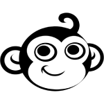

<p align="center">
    <a href="#">
        
    </a>
</p>
<p align="center">
    <a href="LICENSE">
        
    </a>
    <a href="#">
        
    </a>
    <a href="https://github.com/tengames/tom-and-jerry-tnt/issues">
        
    </a>
    <a href="CONTRIBUTING.md">
        
    </a>
</p>

# Tom And Jerry TNT
Tom has stolen Jerry’s cheese and won’t give it back. This makes Jerry very upset, so he vows to get back at Tom at any cost. Help Jerry plant bombs near Tom’s bubble to blow him off his platforms. Do not knock Jerry over or your game will be finished.

## Features

## First glimpse

## Wiki
The [wiki](https://github.com/tengames/tom-and-jerry-tnt/wiki) provides implementation level details and answers to general questions that a developer starting to use this project might have about it.

## Dependencies

## Requirements
- Java 1.6

## License
This project is currently available under the [MIT](LICENSE) License.

## Contributing
Please check out the [contributing guideline](CONTRIBUTING.md) for more details.

## Installation
You can get the sources
```sh
$ git clone https://github.com/tengames/tom-and-jerry-tnt.git
```

<a href="https://www.buymeacoffee.com/congcoi123" target="_blank"></a>

> Happy coding !
